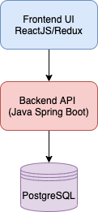

# Chuck Norris jokes operator 

### `chuck-operator` deploy the following stack 

### Deployment - quick start
1. Install [make](https://man7.org/linux/man-pages/man1/make.1.html)
2. `make deploy`
3. `kubectl create -f ./config/samples/chuck.yml`

Development
1. Install [Pipenv](https://pipenv.pypa.io/en/latest/)  
2. Install dependencies `pipenv install`
3. Run ansible locally `pipenv run ansible-playbook playbooks/chuck.yml --extra-vars='{"debug":"true","dry_run":"true","cluster_domain":"chuck.example.com","ansible_operator_meta":{"namespace":"chuck"}}'` 
4. Run `echo -e "[defaults]\nroles_path = $(pwd)/roles" > .ansible.cfg`  and execute `pipenv run ansible-operator run` 
